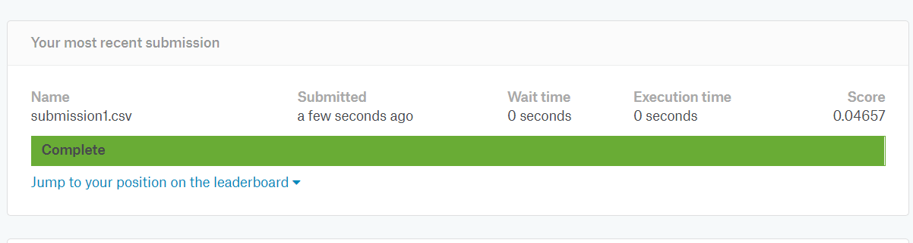

# Dogs VS Cats
  
## 项目说明

输入：一张RGB图像
输出： 类别是猫还是狗

## 数据来源

 Kaggle竞赛项目 [Kaggle dogs vs cats](https://www.kaggle.com/c/dogs-vs-cats-redux-kernels-edition)
 
## 开发环境
  
Linux/Windows10   Python 3.5

### Dependencies
tensorflow 1.0.0
 
keras 2.0.6

## 模型结果


 


```python

```
